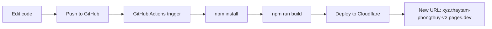

# 🎯 TÓM TẮT: GIẢI PHÁP AUTO-DEPLOY TỪ GITHUB

**Ngày**: 14/01/2026  
**Vấn đề**: Edit code trong GitHub → Website không update → Cloudflare build failed  
**Giải pháp**: Setup GitHub Actions để auto-deploy từ GitHub lên Cloudflare Pages

---

## ✅ ĐÃ HOÀN THÀNH

### 1. **GitHub Actions Workflow**
- **File**: `.github/workflows/deploy.yml`
- **Trigger**: Push to `main` branch
- **Steps**:
  1. Checkout code
  2. Setup Node.js 18
  3. Install dependencies (`npm ci`)
  4. Build project (`npm run build`)
  5. Deploy to Cloudflare Pages

### 2. **Documentation**
- **QUICK_START_AUTO_DEPLOY.md** - Hướng dẫn nhanh 5 phút setup
- **AUTO_DEPLOY_GITHUB_GUIDE.md** - Hướng dẫn chi tiết đầy đủ
- **CLOUDFLARE_API_TOKEN_GUIDE.md** - Hướng dẫn lấy API token & Account ID
- **README.md** - Updated với deployment workflow

### 3. **Git Commits**
- ✅ Commit 1: GitHub Actions workflow
- ✅ Commit 2: Cloudflare API token guide
- ✅ Commit 3: README update
- ✅ Commit 4: Quick Start guide

---

## 📋 HÀNH ĐỘNG NGƯỜI DÙNG (5 PHÚT)

### **BƯỚC 1: LẤY CLOUDFLARE CREDENTIALS**

1. **Account ID**:
   - Login: https://dash.cloudflare.com
   - Avatar → My Profile → API Tokens
   - Copy Account ID (32 ký tự hex)

2. **API Token**:
   - Create Token → Template "Edit Cloudflare Workers"
   - Copy token (40+ ký tự)

---

### **BƯỚC 2: ADD GITHUB SECRETS**

URL: https://github.com/thaytamphongthuy2026-gif/Thay-tam-app1/settings/secrets/actions

**Add 6 secrets:**
```
1. CLOUDFLARE_API_TOKEN = <token_from_step_1>
2. CLOUDFLARE_ACCOUNT_ID = <account_id_from_step_1>
3. SUPABASE_URL = https://jnfpxvodlmfukpagozcw.supabase.co
4. SUPABASE_SERVICE_KEY = <your_key>
5. SUPABASE_JWT_SECRET = <your_secret>
6. GEMINI_API_KEY = <your_key>
```

---

### **BƯỚC 3: TEST AUTO-DEPLOY**

1. **Push test commit**:
   - Edit any file in GitHub (e.g., README.md)
   - Commit & push to `main`

2. **Check GitHub Actions**:
   - URL: https://github.com/thaytamphongthuy2026-gif/Thay-tam-app1/actions
   - Đợi 2-3 phút → Status: ✅ Success

3. **Verify Deployment**:
   - New URL: https://xyz.thaytam-phongthuy-v2.pages.dev
   - Test website → Should see changes

---

## 🎯 WORKFLOW SAU KHI SETUP



**Thời gian**: 2-3 phút mỗi lần deploy

**Monitoring**:
- GitHub: https://github.com/thaytamphongthuy2026-gif/Thay-tam-app1/actions
- Cloudflare: https://dash.cloudflare.com → thaytam-phongthuy-v2 → Deployments

---

## ✅ LỢI ÍCH

### Trước đây:
- ❌ Edit GitHub → Website không update
- ❌ Phải chạy `wrangler deploy` manually
- ❌ Build failed không rõ lỗi
- ❌ Không có deployment history

### Sau khi setup:
- ✅ Edit GitHub → Auto-deploy (2-3 phút)
- ✅ No manual deploy needed
- ✅ GitHub Actions logs chi tiết
- ✅ Deployment history đầy đủ
- ✅ Rollback dễ dàng (nếu cần)
- ✅ Monitoring tập trung (GitHub + Cloudflare)

---

## 📊 MONITORING & LOGS

### GitHub Actions:
```
URL: https://github.com/thaytamphongthuy2026-gif/Thay-tam-app1/actions

Information:
- Workflow runs history
- Build logs chi tiết
- Success/failure status
- Deployment time
- Error messages (if any)
```

### Cloudflare Pages:
```
URL: https://dash.cloudflare.com → thaytam-phongthuy-v2 → Deployments

Information:
- All deployments list
- Commit messages
- Deployment URLs
- Build output
- Functions logs
```

---

## 🐛 TROUBLESHOOTING

### Issue: GitHub Actions failed

**Check**:
1. GitHub Actions logs → Error message
2. GitHub Settings → Secrets → Verify all 6 secrets added
3. Workflow file: `.github/workflows/deploy.yml` exists

**Fix**:
- Add missing secrets
- Verify Cloudflare API token permissions
- Check Account ID format (32 hex chars)

---

### Issue: Deployment success nhưng website lỗi 500

**Check**:
1. Cloudflare Functions logs
2. Verify environment variables (all 4 secrets)

**Fix**:
- Add missing SUPABASE_* secrets
- Add GEMINI_API_KEY secret

---

### Issue: Push lên GitHub nhưng không trigger Actions

**Check**:
1. Branch name: phải là `main` (không phải `master`)
2. Workflow file: `.github/workflows/deploy.yml` exists
3. GitHub Actions enabled: Settings → Actions → Enabled

**Fix**:
- Push to correct branch: `main`
- Enable GitHub Actions if disabled

---

## 📦 FILES CREATED

```
/home/user/webapp/
├── .github/
│   └── workflows/
│       └── deploy.yml                    # GitHub Actions workflow
├── AUTO_DEPLOY_GITHUB_GUIDE.md           # Chi tiết đầy đủ
├── CLOUDFLARE_API_TOKEN_GUIDE.md         # Hướng dẫn API token
├── QUICK_START_AUTO_DEPLOY.md            # Quick start 5 phút
└── README.md                              # Updated
```

---

## 🎯 NEXT STEPS

### Bây giờ (5 phút):
1. [ ] Follow **QUICK_START_AUTO_DEPLOY.md**
2. [ ] Lấy Cloudflare credentials (Bước 1)
3. [ ] Add GitHub secrets (Bước 2)
4. [ ] Test push commit (Bước 3)

### Sau khi test OK:
5. [ ] Setup custom domain: `thaytamphongthuy.com`
6. [ ] Submit sitemap to Google Search Console
7. [ ] Monitor SEO performance

---

## ✅ CHECKLIST FINAL

**Setup:**
- [x] GitHub Actions workflow created
- [x] Documentation complete (4 files)
- [x] README updated
- [ ] User follow setup guide (5 phút)
- [ ] Test deployment success

**User Actions (Pending):**
- [ ] Lấy Cloudflare Account ID
- [ ] Tạo Cloudflare API Token
- [ ] Add 6 GitHub Secrets
- [ ] Push test commit
- [ ] Verify auto-deploy works

---

## 📞 SUPPORT

**Nếu gặp vấn đề:**
1. Check documentation:
   - `QUICK_START_AUTO_DEPLOY.md` (recommended)
   - `AUTO_DEPLOY_GITHUB_GUIDE.md` (detailed)
   - `CLOUDFLARE_API_TOKEN_GUIDE.md` (API setup)

2. Check logs:
   - GitHub Actions logs (error messages)
   - Cloudflare Functions logs (runtime errors)

3. Common issues:
   - Missing secrets → Add all 6 secrets
   - Wrong Account ID → Re-copy from Cloudflare
   - API token expired → Create new token

---

## 🎉 KẾT LUẬN

**Status**: ✅ Code complete & ready for user setup

**Timeline**: 
- ✅ Development: Complete
- ⏳ User setup: 5 phút (follow QUICK_START)
- ⏳ First deployment: 2-3 phút (after push)

**Expected Result**:
- Edit code in GitHub → Auto-deploy (2-3 phút)
- No manual `wrangler deploy` needed
- Deployment history tracked
- Easy monitoring via GitHub Actions

**Recommendation**: Follow **QUICK_START_AUTO_DEPLOY.md** để setup nhanh nhất!

---

**Last Updated**: 14/01/2026  
**Commits**: 4 commits pushed  
**Status**: ✅ Ready for user testing
